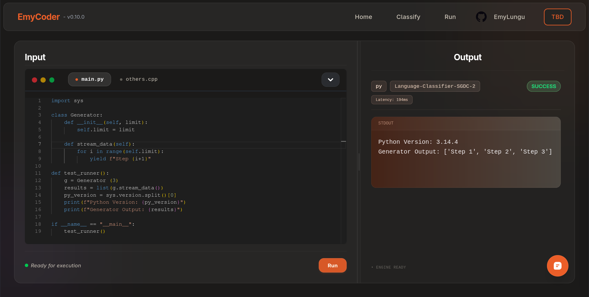
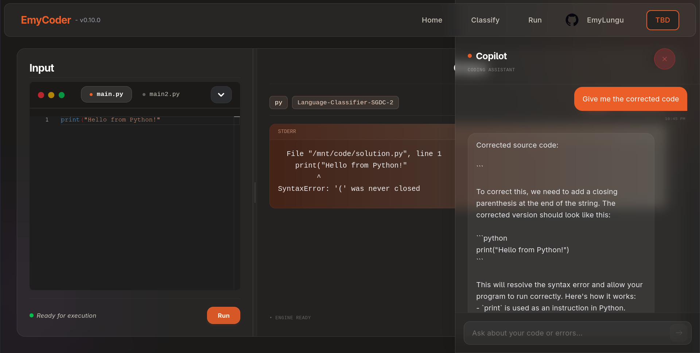
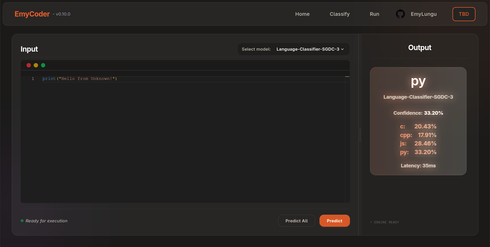

# EmyCoder: A Secure, AI-Powered Playground for Code Learning

**EmyCoder** is a high-performance **Fullstack** application backed by a comprehensive **MLOps** platform built to provide a safe, **intelligent environment** for running and learning code. By combining custom-trained **machine learning** models with isolated execution environments, it offers a secure "**sandbox**" where users can experiment with code, receive **AI-driven guidance**, and explore the lifecycle of a production-grade ML system.

The platform handles everything from the initial data scrape to secure script execution. It features a **language classifier** trained from **scratch** on a unique GitHub-sourced dataset, managed and versioned through a dedicated MLOps pipeline. To enhance the learning experience, **EmyCoder** integrates basic **computer vision** for **text extraction** and a fully local **AI chat assistant**, ensuring that your data and code never leave your infrastructure.

#### Runner:

#### Assistant:

#### Classifier:

## 🚀 Key Features

* **Language Detection:** Uses an incrementally trained `scikit-learn` model to identify code languages.
* **Version Control:** Users can toggle between different iterations of the ML model hosted on the `MLFlow server`.
They can also run all the models and get each and every one's prediction.
* **Secure Execution:** Code snippets are executed inside isolated **Docker containers** to ensure host safety.
* **Self-hosted Chat Assistant** The user can **ask for help** in a **chat** based environment.
* **Custom Dataset:** The Language Classifier was **trained** on a unique dataset scraped from GitHub and stored in **MongoDB**.
* **RESTful API:** Clean and documented endpoints powered by FastAPI.

## 🏗️ Architecture

1.  **Ingestion:** Code snippets are received via POST requests.
2.  **Classification:** The snippet is passed to a specific version of a pre-trained `sklearn` classifier.
3.  **Isolation:** If execution is requested, the code is mounted into a transient Docker container.
4.  **Reporting:** Output (stdout/stderr) and the predicted language are returned to the user.

## 🛠️ Tech Stack

* **Framework:** [FastAPI](https://fastapi.tiangolo.com/)
* **ML Library:** [scikit-learn](https://scikit-learn.org/) (Incremental learning using `SGDClassifier`)
* **MLFlow:** [mlflow](https://mlflow.org/) (Models management and deployment)
* **Ollama:** [Ollama](https://ollama.com/) (Locally hosted LLM Inference Engine)
* **LangChain:** [LangChain](https://www.langchain.com/) (Turns the Ollama hosted models into a Chat-based Assistants)
* **Database:** [MongoDB](https://www.mongodb.com/) (Training data storage)
* **Containerization:** [Docker](https://www.docker.com/) (Snippet isolation)

    ### Frontend Tech Stack
* **Framework:** [React](https://react.dev/) with [TypeScript](https://www.typescriptlang.org/)
* **Styling:** [Tailwind CSS](https://tailwindcss.com/)
* **Code Editor:** [Monaco Editor](https://microsoft.github.io/monaco-editor/) (the engine behind VS Code) for syntax highlighting and a native coding feel.

## 📥 Getting Started

### Prerequisites
- Docker installed and running
- The `FastAPI` and the `MongoDB` instances are hosted in Docker containers.

### Installation
###### (Future automatization will cover most of it)
1. Clone the repo `git@github.com:EmyLungu/EmyCoder.git`
- Setup the `.env`
- Start the MongoDB container `db/docker-compose.yml` and `db/initalizer.py`
2. Run the `scraper/main.py`
3. Load the data from the db to a `.parquet` file using the `trainer/loader.py`
- Start `MLFlow` local server and `FastAPi` instance from `docker-compose.yml`
- Train using `trainer/main.py`:
the runs are automatically registered in the model registry, add your best model the `@champion` alias.

### Ollama Setup
- Download a local LLM and put it in `ollama/`
- Write Modelfile as in example
- Add it to the ollama server: `docker exec -it emycoder-ollama ollama create emycoder-qwen -f /root/models/Modelfile`
- Check if it is listed: `docker exec -it emycoder-ollama ollama list`